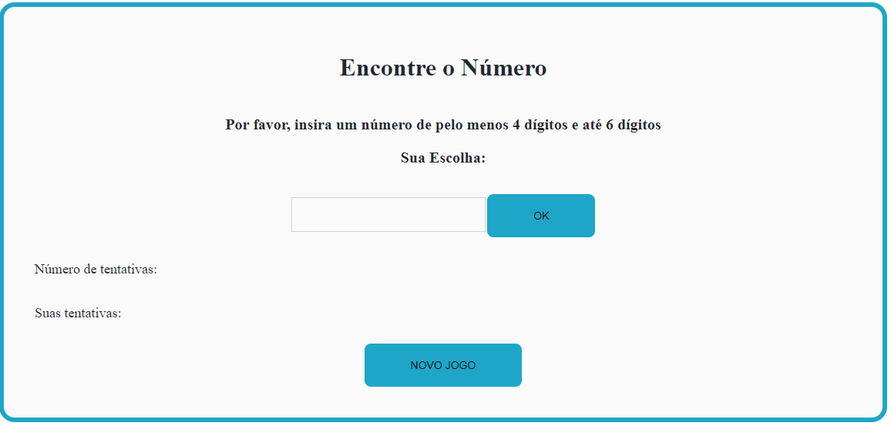

<h1 align="center"> Jogo de Adivinhação: Encontre o PIN </h1>

<h2 align="center"> <i>Desafio de Lógica e um Pouco de Sorte</i></h2>

## Introdução

Este é um jogo de adivinhação simples em que o usuário deve tentar adivinhar um número gerado aleatóriamente pela máquina. O objetivo é acertar o valor correto.

## Como jogar
1) **Iniciando com um valor**

O usuário escolhe e digita um número qualquer de -pelo menos- <strong>quatro</strong> dígitos e com uma quantidade -máxima- de <strong>seis</strong> dígitos no campo indicado como "Sua Escolha".

2) **Verificação do PIN escolhido**

Ao pressionar “Enter” ou clicar no botão “OK”, o código verifica se o número inserido corresponde ao número gerado pela máquina.

3) **Dicas caso você não acerte o PIN**

O jogo fornece dicas para ajudar o usuário a acertar o valor:
“Maior”: Se o número inserido for menor do que o número gerado.
“Menor”: Se o número inserido for maior do que o número gerado.
“Muito maior” ou “Muito menor”: Se a diferença entre o número inserido e o número gerado for significativa.

 **Observação:**
 

Caso seja informado um valor inválido pelo usuário, o mesmo não será incluido como tentativa e aparecerá uma mensagem informando para adicionar outro número.
 

 
**Sugestões de Melhoras:**

1) Limitar tentativas do jogador para aumentar o desafio e o entretenimento.

2) Ajustar as pistas fornecidas ao jogador para incentivar o uso do raciocínio lógico em detrimento da dependência da sorte. Por exemplo, se o jogador acertar um dígito, essa informação poderia ser revelada a ele.

## Detalhes do Desenvolvimento
Passos:

1) O repositório específico do desafio contido no Github foi clonado;
2) A branch foi criada para submeter o código no Github;
3) Um arquivo foi criado para colocar o programa JavaScript (.js);
4) Desenvolvimento do código;
5) Após testado na máquina local, os arquivos de código e o README foram adicionados no GitHub.

## Dificuldades Encontradas

As principais dificuldades encontradas envolvem o desenvolvimento do código:
1) Definição do tipo de entrada do usuário. Por exemplo, se a entrada for inteira, 0000 não difere de 000000. Com isso, a opção escolhida foi uma entrada de string, mas isso faz com que seja necessário separar os caracteres da string e transformar para inteiro para comparar;

2) A geração do PIN é realizada de forma randômica neste código. Inicialmente o código gerava um número aleatório entre 4 e 6 para a quantidade de dígitos do PIN e posteriormente sorteava cada um desses dígitos. Isso fazia ser possível gerar PINs como 0000 e 000000. O problema enfrentado neste caso, foi que na específicação do problema, as dicas que o programa fornece são: "muito maior", "muito menor", "maior" e "menor". Levando isso em consideração, ficaria difícil acertar o valor, pois é difícil dizer se 0000 é maior ou menor que 000000 [optou-se por gerar PINs de apenas 4 dígitos para contornar esse problema];

3) Definição da intensidade "Muito". O quão distante o PIN inserido pelo usuário precisa estar do PIN sorteado pela máquina para ser caracterizado de "Muito"? [A solução foi implementada pensando em algoritmos de busca binária].

## Recursos

HTML, CSS e JavaScript.
Interface de usuário com campo de entrada e botão “OK”.
Exibição das tentativas e dos números já digitados pelo usuário.
Botão para jogar novamente "NOVO JOGO". 
Divirta-se jogando! 🎮

## Agradecimentos

Agradeço à CompassUOL por providenciar o acesso aos cursos da Udemy, que geraram o aprendizado e desenvolvimento necessário para esta implementação e muito mais.

## Licença
Este projeto é distribuído sem uma licença explícita e é destinado ao uso educacional e de entretenimento.

## Autor
**Pâmela Aliny Cleto Pavan**
- Linkedin: www.linkedin.com/in/pâmela-pavan-607693190 
- Email : pamelaaliny@gmail.com
